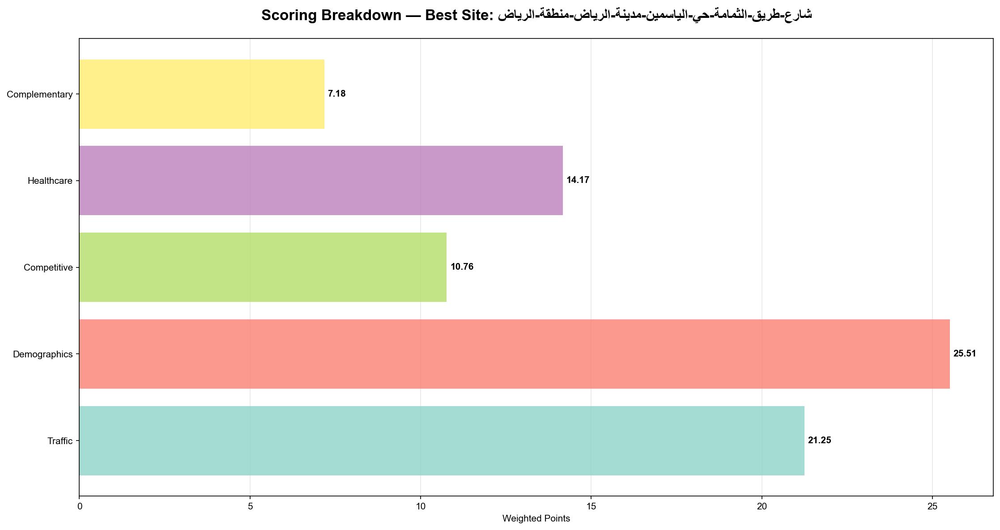
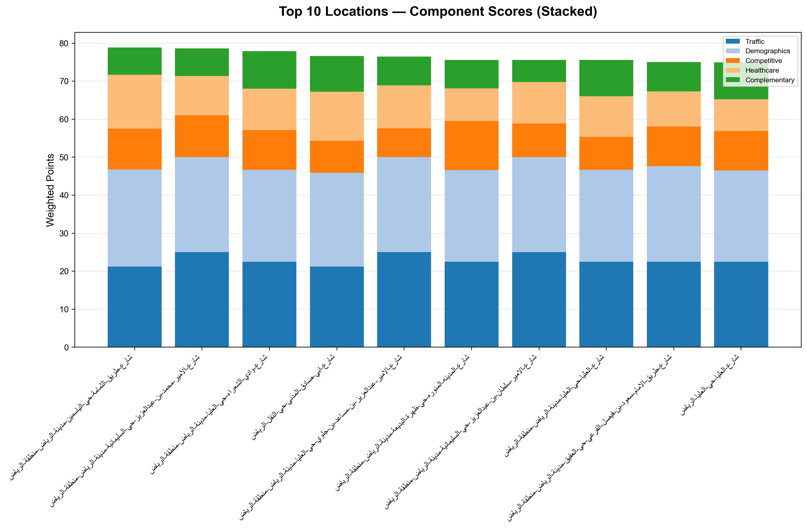
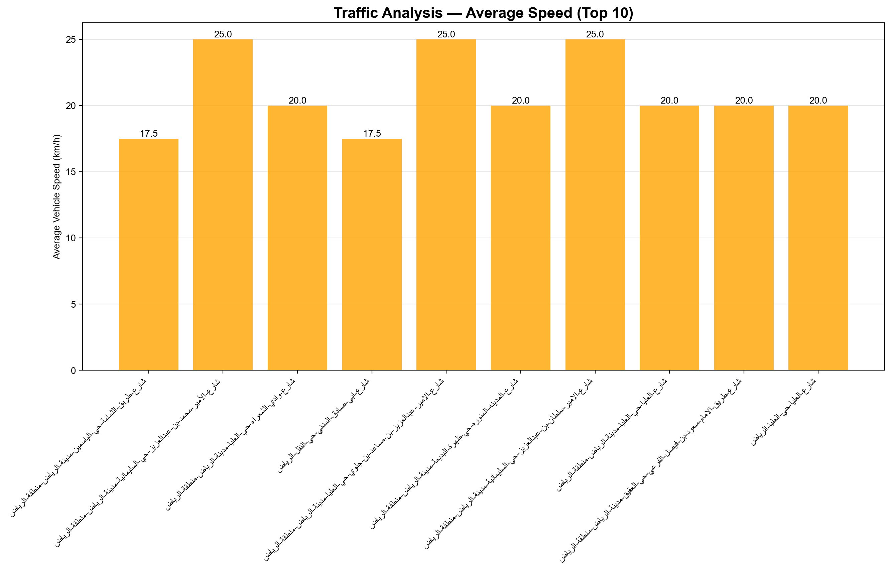
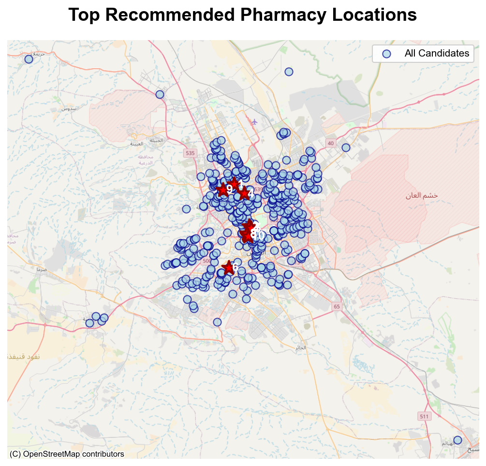
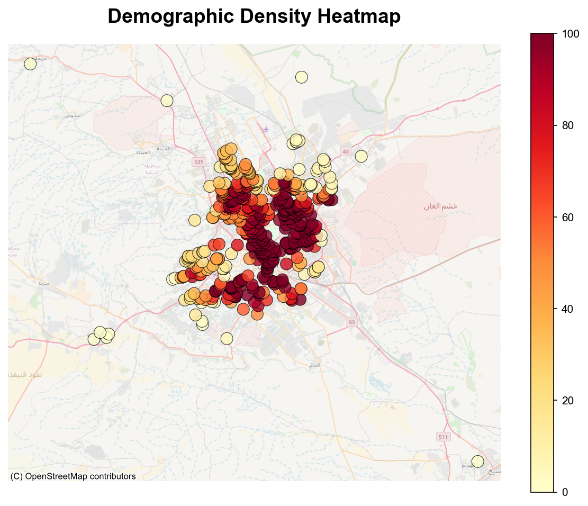

<h1>🧭 Pharmacy Expansion Analysis — Riyadh</h1>

Automated report — multi-criteria scoring across traffic, demographics, competition, healthcare, and complementary businesses.

## Executive Summary

**Top recommendation:** **شارع-الأمير-بندر-بن-عبدالعزيز-حي-الخليج-مدينة-الرياض-منطقة-الرياض** — overall score 48.53 / 100.0 (48.5%).

This report evaluates candidate pharmacy sites using a multi-criteria scoring approach (traffic, demographics, competition, healthcare proximity, and complementary businesses). The goal is to produce an ordered shortlist of locations for further due diligence and site visits.

---

## Methodology (summary)

- **Input:** a JSON `scores` file where each candidate includes `lat`, `lng` (optional), `place name` (preferred), and per-criterion `overall_score` and `details`.
- **Scoring:** criterion overall_score is expected in criterion units; details (0–100) are used to compute audit-weighted contributions.
- **Aggregation:** `total_score` = sum of criterion overall_score. `total_pct` = total_score / max_total * 100.
- **Ranking:** top locations by `total_score` descending.

---

## Detailed Site Analysis

Top 10 candidates summary:

| Rank | Site Name | Coordinates | Total Score | Total % |
|---:|---|---|---:|---:|
| 1 | `شارع-الأمير-بندر-بن-عبدالعزيز-حي-الخليج-مدينة-الرياض-منطقة-الرياض` | 24.765400, 46.803593 | 48.53 | 48.5% |
| 2 | `شارع-احمد-ابن-حنبل-حي-الروابي-مدينة-الرياض-منطقة-الرياض` | 24.705559, 46.784199 | 45.75 | 45.7% |
| 3 | `شارع-العليا-حي-الملك-فهد-مدينة-الرياض-منطقة-الرياض` | 24.735048, 46.664703 | 45.23 | 45.2% |
| 4 | `شارع-مسلة-حي-الاندلس-الرياض-منطقة-الرياض` | 24.734850, 46.792118 | 44.65 | 44.7% |
| 5 | `شارع-القنا-حي-النرجس-الرياض-منطقة-الرياض` | 24.836605, 46.659592 | 42.38 | 42.4% |
| 6 | `شارع-اللؤلؤة-حي-العارض-مدينة-الرياض-منطقة-الرياض` | 24.861195, 46.628616 | 41.99 | 42.0% |
| 7 | `شارع-وادى-فاطمه-حي-ضاحية-نمار-مدينة-الرياض-منطقة-الرياض` | 24.521158, 46.528305 | 40.76 | 40.8% |
| 8 | `شارع-حمزة-بن-عبدالمطلب-حي-العريجاء-الغربية-الرياض-منطقة-الرياض` | 24.613752, 46.602638 | 40.34 | 40.3% |
| 9 | `حي-الخالدية-الدرعية-الدرعية` | 24.751221, 46.574001 | 37.17 | 37.2% |
| 10 | `طريق-الملك-عبدالعزيز-حي-العارض-الرياض-منطقة-الرياض` | 24.901823, 46.603397 | 26.42 | 26.4% |

### 1. شارع-الأمير-بندر-بن-عبدالعزيز-حي-الخليج-مدينة-الرياض-منطقة-الرياض

**Open in Google Maps:** <https://www.google.com/maps/search/?api=1&query=24.765399932861328,46.803592681884766>

**Location:** lat 24.765400, lng 46.803593

| Evaluation Criterion | Sub-factor | Raw (0–100) | Weighted pts |
|---|---|---:|---:|
| Traffic | Average Viechle Speed | 100.0 | 8.33 |
| Traffic | highway score | 50.0 | 4.17 |
| Traffic | Daily Vehicle count |  |  |
| **Traffic (total)** |  |  | **12.50** |
| Demographics | Residential density within 3km driving radius | 88.3 | 6.62 |
| Demographics | Age distribution above 35 | 43.3 | 3.25 |
| Demographics | Income levels | 69.0 | 5.17 |
| Demographics | Household composition | 52.0 | 3.90 |
| **Demographics (total)** |  |  | **18.94** |
| Competitive | Distance to nearest pharmacy | 1.5 | 0.08 |
| Competitive | Market saturation | 65.9 | 3.29 |
| Competitive | Underserved population pockets |  |  |
| **Competitive (total)** |  |  | **3.37** |
| Healthcare | Proximity to hospitals | 30.4 | 3.04 |
| Healthcare | Proximity to dentists | 27.3 | 2.73 |
| **Healthcare (total)** |  |  | **5.78** |
| Complementary | grocery store | 0.0 | 0.00 |
| Complementary | supermarkets | 0.0 | 0.00 |
| Complementary | restaurants | 0.0 | 0.00 |
| Complementary | ATMs | 0.0 | 0.00 |
| Complementary | Banks | 0.0 | 0.00 |
| **Complementary (total)** |  |  | **0.00** |

### 2. شارع-احمد-ابن-حنبل-حي-الروابي-مدينة-الرياض-منطقة-الرياض

**Open in Google Maps:** <https://www.google.com/maps/search/?api=1&query=24.70555877685547,46.78419876098633>

**Location:** lat 24.705559, lng 46.784199

| Evaluation Criterion | Sub-factor | Raw (0–100) | Weighted pts |
|---|---|---:|---:|
| Traffic | Average Viechle Speed | 70.0 | 5.83 |
| Traffic | highway score | 50.0 | 4.17 |
| Traffic | Daily Vehicle count |  |  |
| **Traffic (total)** |  |  | **10.00** |
| Demographics | Residential density within 3km driving radius | 100.0 | 7.50 |
| Demographics | Age distribution above 35 | 44.7 | 3.35 |
| Demographics | Income levels | 70.1 | 5.26 |
| Demographics | Household composition | 48.0 | 3.60 |
| **Demographics (total)** |  |  | **19.71** |
| Competitive | Distance to nearest pharmacy | 2.9 | 0.14 |
| Competitive | Market saturation | 74.5 | 3.73 |
| Competitive | Underserved population pockets |  |  |
| **Competitive (total)** |  |  | **3.87** |
| Healthcare | Proximity to hospitals | 33.3 | 3.33 |
| Healthcare | Proximity to dentists | 19.1 | 1.91 |
| **Healthcare (total)** |  |  | **5.24** |
| Complementary | grocery store | 0.0 | 0.00 |
| Complementary | supermarkets | 0.0 | 0.00 |
| Complementary | restaurants | 0.0 | 0.00 |
| Complementary | ATMs | 0.0 | 0.00 |
| Complementary | Banks | 0.0 | 0.00 |
| **Complementary (total)** |  |  | **0.00** |

### 3. شارع-العليا-حي-الملك-فهد-مدينة-الرياض-منطقة-الرياض

**Open in Google Maps:** <https://www.google.com/maps/search/?api=1&query=24.735048294067383,46.664703369140625>

**Location:** lat 24.735048, lng 46.664703

| Evaluation Criterion | Sub-factor | Raw (0–100) | Weighted pts |
|---|---|---:|---:|
| Traffic | Average Viechle Speed | 100.0 | 8.33 |
| Traffic | highway score | 50.0 | 4.17 |
| Traffic | Daily Vehicle count |  |  |
| **Traffic (total)** |  |  | **12.50** |
| Demographics | Residential density within 3km driving radius | 68.6 | 5.15 |
| Demographics | Age distribution above 35 | 48.0 | 3.60 |
| Demographics | Income levels | 84.2 | 6.32 |
| Demographics | Household composition | 42.4 | 3.18 |
| **Demographics (total)** |  |  | **18.24** |
| Competitive | Distance to nearest pharmacy | 6.1 | 0.31 |
| Competitive | Market saturation | 43.1 | 2.15 |
| Competitive | Underserved population pockets |  |  |
| **Competitive (total)** |  |  | **2.46** |
| Healthcare | Proximity to hospitals | 26.1 | 2.61 |
| Healthcare | Proximity to dentists | 19.4 | 1.94 |
| **Healthcare (total)** |  |  | **4.55** |
| Complementary | grocery store | 0.0 | 0.00 |
| Complementary | supermarkets | 0.0 | 0.00 |
| Complementary | restaurants | 0.0 | 0.00 |
| Complementary | ATMs | 0.0 | 0.00 |
| Complementary | Banks | 0.0 | 0.00 |
| **Complementary (total)** |  |  | **0.00** |

### 4. شارع-مسلة-حي-الاندلس-الرياض-منطقة-الرياض

**Open in Google Maps:** <https://www.google.com/maps/search/?api=1&query=24.73484992980957,46.792118072509766>

**Location:** lat 24.734850, lng 46.792118

| Evaluation Criterion | Sub-factor | Raw (0–100) | Weighted pts |
|---|---|---:|---:|
| Traffic | Average Viechle Speed | 70.0 | 5.83 |
| Traffic | highway score | 50.0 | 4.17 |
| Traffic | Daily Vehicle count |  |  |
| **Traffic (total)** |  |  | **10.00** |
| Demographics | Residential density within 3km driving radius | 100.0 | 7.50 |
| Demographics | Age distribution above 35 | 44.5 | 3.34 |
| Demographics | Income levels | 72.7 | 5.45 |
| Demographics | Household composition | 48.0 | 3.60 |
| **Demographics (total)** |  |  | **19.89** |
| Competitive | Distance to nearest pharmacy | 9.3 | 0.46 |
| Competitive | Market saturation | 77.0 | 3.85 |
| Competitive | Underserved population pockets |  |  |
| **Competitive (total)** |  |  | **4.31** |
| Healthcare | Proximity to hospitals | 22.3 | 2.23 |
| Healthcare | Proximity to dentists | 10.7 | 1.07 |
| **Healthcare (total)** |  |  | **3.30** |
| Complementary | grocery store | 0.0 | 0.00 |
| Complementary | supermarkets | 0.0 | 0.00 |
| Complementary | restaurants | 0.0 | 0.00 |
| Complementary | ATMs | 0.0 | 0.00 |
| Complementary | Banks | 0.0 | 0.00 |
| **Complementary (total)** |  |  | **0.00** |

### 5. شارع-القنا-حي-النرجس-الرياض-منطقة-الرياض

**Open in Google Maps:** <https://www.google.com/maps/search/?api=1&query=24.836605072021484,46.65959167480469>

**Location:** lat 24.836605, lng 46.659592

| Evaluation Criterion | Sub-factor | Raw (0–100) | Weighted pts |
|---|---|---:|---:|
| Traffic | Average Viechle Speed | 70.0 | 5.83 |
| Traffic | highway score | 50.0 | 4.17 |
| Traffic | Daily Vehicle count |  |  |
| **Traffic (total)** |  |  | **10.00** |
| Demographics | Residential density within 3km driving radius | 46.1 | 3.46 |
| Demographics | Age distribution above 35 | 43.7 | 3.28 |
| Demographics | Income levels | 79.5 | 5.96 |
| Demographics | Household composition | 67.4 | 5.06 |
| **Demographics (total)** |  |  | **17.75** |
| Competitive | Distance to nearest pharmacy | 8.7 | 0.44 |
| Competitive | Market saturation | 72.4 | 3.62 |
| Competitive | Underserved population pockets |  |  |
| **Competitive (total)** |  |  | **4.05** |
| Healthcare | Proximity to hospitals | 12.9 | 1.29 |
| Healthcare | Proximity to dentists | 22.6 | 2.26 |
| **Healthcare (total)** |  |  | **3.55** |
| Complementary | grocery store | 0.0 | 0.00 |
| Complementary | supermarkets | 0.0 | 0.00 |
| Complementary | restaurants | 0.0 | 0.00 |
| Complementary | ATMs | 0.0 | 0.00 |
| Complementary | Banks | 0.0 | 0.00 |
| **Complementary (total)** |  |  | **0.00** |

### 6. شارع-اللؤلؤة-حي-العارض-مدينة-الرياض-منطقة-الرياض

**Open in Google Maps:** <https://www.google.com/maps/search/?api=1&query=24.861194610595703,46.62861633300781>

**Location:** lat 24.861195, lng 46.628616

| Evaluation Criterion | Sub-factor | Raw (0–100) | Weighted pts |
|---|---|---:|---:|
| Traffic | Average Viechle Speed | 100.0 | 8.33 |
| Traffic | highway score | 50.0 | 4.17 |
| Traffic | Daily Vehicle count |  |  |
| **Traffic (total)** |  |  | **12.50** |
| Demographics | Residential density within 3km driving radius | 37.0 | 2.78 |
| Demographics | Age distribution above 35 | 43.4 | 3.25 |
| Demographics | Income levels | 75.8 | 5.69 |
| Demographics | Household composition | 67.0 | 5.03 |
| **Demographics (total)** |  |  | **16.74** |
| Competitive | Distance to nearest pharmacy | 0.2 | 0.01 |
| Competitive | Market saturation | 53.8 | 2.69 |
| Competitive | Underserved population pockets |  |  |
| **Competitive (total)** |  |  | **2.70** |
| Healthcare | Proximity to hospitals | 20.5 | 2.05 |
| Healthcare | Proximity to dentists | 3.9 | 0.39 |
| **Healthcare (total)** |  |  | **2.44** |
| Complementary | grocery store | 0.0 | 0.00 |
| Complementary | supermarkets | 0.0 | 0.00 |
| Complementary | restaurants | 0.0 | 0.00 |
| Complementary | ATMs | 0.0 | 0.00 |
| Complementary | Banks | 0.0 | 0.00 |
| **Complementary (total)** |  |  | **0.00** |

### 7. شارع-وادى-فاطمه-حي-ضاحية-نمار-مدينة-الرياض-منطقة-الرياض

**Open in Google Maps:** <https://www.google.com/maps/search/?api=1&query=24.52115821838379,46.52830505371094>

**Location:** lat 24.521158, lng 46.528305

| Evaluation Criterion | Sub-factor | Raw (0–100) | Weighted pts |
|---|---|---:|---:|
| Traffic | Average Viechle Speed | 70.0 | 5.83 |
| Traffic | highway score | 50.0 | 4.17 |
| Traffic | Daily Vehicle count |  |  |
| **Traffic (total)** |  |  | **10.00** |
| Demographics | Residential density within 3km driving radius | 10.1 | 0.76 |
| Demographics | Age distribution above 35 | 36.0 | 2.70 |
| Demographics | Income levels | 53.2 | 3.99 |
| Demographics | Household composition | 100.0 | 7.50 |
| **Demographics (total)** |  |  | **14.95** |
| Competitive | Distance to nearest pharmacy | 56.2 | 2.81 |
| Competitive | Market saturation | 87.9 | 4.39 |
| Competitive | Underserved population pockets |  |  |
| **Competitive (total)** |  |  | **7.21** |
| Healthcare | Proximity to hospitals | 0.0 | 0.00 |
| Healthcare | Proximity to dentists | 0.0 | 0.00 |
| **Healthcare (total)** |  |  | **0.00** |
| Complementary | grocery store | 0.0 | 0.00 |
| Complementary | supermarkets | 0.0 | 0.00 |
| Complementary | restaurants | 0.0 | 0.00 |
| Complementary | ATMs | 0.0 | 0.00 |
| Complementary | Banks | 0.0 | 0.00 |
| **Complementary (total)** |  |  | **0.00** |

### 8. شارع-حمزة-بن-عبدالمطلب-حي-العريجاء-الغربية-الرياض-منطقة-الرياض

**Open in Google Maps:** <https://www.google.com/maps/search/?api=1&query=24.613752365112305,46.602638244628906>

**Location:** lat 24.613752, lng 46.602638

| Evaluation Criterion | Sub-factor | Raw (0–100) | Weighted pts |
|---|---|---:|---:|
| Traffic | Average Viechle Speed | 100.0 | 8.33 |
| Traffic | highway score | 50.0 | 4.17 |
| Traffic | Daily Vehicle count |  |  |
| **Traffic (total)** |  |  | **12.50** |
| Demographics | Residential density within 3km driving radius | 36.4 | 2.73 |
| Demographics | Age distribution above 35 | 44.5 | 3.34 |
| Demographics | Income levels | 67.8 | 5.08 |
| Demographics | Household composition | 67.6 | 5.07 |
| **Demographics (total)** |  |  | **16.22** |
| Competitive | Distance to nearest pharmacy | 1.0 | 0.05 |
| Competitive | Market saturation | 55.3 | 2.77 |
| Competitive | Underserved population pockets |  |  |
| **Competitive (total)** |  |  | **2.82** |
| Healthcare | Proximity to hospitals | 11.0 | 1.10 |
| Healthcare | Proximity to dentists | 0.4 | 0.04 |
| **Healthcare (total)** |  |  | **1.14** |
| Complementary | grocery store | 0.0 | 0.00 |
| Complementary | supermarkets | 0.0 | 0.00 |
| Complementary | restaurants | 0.0 | 0.00 |
| Complementary | ATMs | 0.0 | 0.00 |
| Complementary | Banks | 0.0 | 0.00 |
| **Complementary (total)** |  |  | **0.00** |

### 9. حي-الخالدية-الدرعية-الدرعية

**Open in Google Maps:** <https://www.google.com/maps/search/?api=1&query=24.751220703125,46.57400131225586>

**Location:** lat 24.751221, lng 46.574001

| Evaluation Criterion | Sub-factor | Raw (0–100) | Weighted pts |
|---|---|---:|---:|
| Traffic | Average Viechle Speed | 30.0 | 2.50 |
| Traffic | highway score | 50.0 | 4.17 |
| Traffic | Daily Vehicle count |  |  |
| **Traffic (total)** |  |  | **6.67** |
| Demographics | Residential density within 3km driving radius | 28.9 | 2.17 |
| Demographics | Age distribution above 35 | 46.0 | 3.45 |
| Demographics | Income levels | 90.3 | 6.77 |
| Demographics | Household composition | 57.8 | 4.34 |
| **Demographics (total)** |  |  | **16.73** |
| Competitive | Distance to nearest pharmacy | 0.4 | 0.02 |
| Competitive | Market saturation | 80.3 | 4.01 |
| Competitive | Underserved population pockets |  |  |
| **Competitive (total)** |  |  | **4.03** |
| Healthcare | Proximity to hospitals | 36.1 | 3.61 |
| Healthcare | Proximity to dentists | 7.8 | 0.78 |
| **Healthcare (total)** |  |  | **4.40** |
| Complementary | grocery store | 0.0 | 0.00 |
| Complementary | supermarkets | 0.0 | 0.00 |
| Complementary | restaurants | 0.0 | 0.00 |
| Complementary | ATMs | 0.0 | 0.00 |
| Complementary | Banks | 0.0 | 0.00 |
| **Complementary (total)** |  |  | **0.00** |

### 10. طريق-الملك-عبدالعزيز-حي-العارض-الرياض-منطقة-الرياض

**Open in Google Maps:** <https://www.google.com/maps/search/?api=1&query=24.901823043823242,46.603397369384766>

**Location:** lat 24.901823, lng 46.603397

| Evaluation Criterion | Sub-factor | Raw (0–100) | Weighted pts |
|---|---|---:|---:|
| Traffic | Average Viechle Speed | 30.0 | 2.50 |
| Traffic | highway score | 50.0 | 4.17 |
| Traffic | Daily Vehicle count |  |  |
| **Traffic (total)** |  |  | **6.67** |
| Demographics | Residential density within 3km driving radius | 11.0 | 0.82 |
| Demographics | Age distribution above 35 | 44.0 | 3.30 |
| Demographics | Income levels | 75.6 | 5.67 |
| Demographics | Household composition | 49.4 | 3.71 |
| **Demographics (total)** |  |  | **13.50** |
| Competitive | Distance to nearest pharmacy | 12.7 | 0.64 |
| Competitive | Market saturation | 16.6 | 0.83 |
| Competitive | Underserved population pockets |  |  |
| **Competitive (total)** |  |  | **1.47** |
| Healthcare | Proximity to hospitals | 7.2 | 0.72 |
| Healthcare | Proximity to dentists | 0.0 | 0.00 |
| **Healthcare (total)** |  |  | **0.72** |
| Complementary | grocery store | 0.0 | 0.00 |
| Complementary | supermarkets | 0.0 | 0.00 |
| Complementary | restaurants | 0.0 | 0.00 |
| Complementary | ATMs | 0.0 | 0.00 |
| Complementary | Banks | 0.0 | 0.00 |
| **Complementary (total)** |  |  | **0.00** |

---

### Charts & Visualizations

**Top candidates comparison:** 

**Traffic flow:** 

---

### Maps

**Candidates map:**

**Demographic heatmap:**

---

## Limitations & next steps

- Missing detail values were treated as neutral (non-contributing).
- For richer maps (tiles, basemaps), consider adding context tiles or running an HTML map generator.

---

## Run manifest & artifacts

- Manifest: `run_manifest.json`
- Processed candidates JSON: `data/candidates_processed.json`

